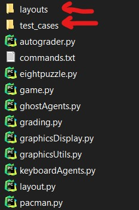

# CS 188 — Project 3: Reinforcement Learning

This repository contains my solution for **Project 3: Reinforcement Learning** from CS 188 (Fall 2024). In this project, I implement value iteration, Q‑learning, and approximate Q‑learning agents for a variety of environments (Gridworld, Crawler, and Pacman).

Source/credit: https://inst.eecs.berkeley.edu/~cs188/fa24/projects/proj3/

## Overview

In **Project 3**, you work on building agents that learn to act optimally in Markov Decision Processes (MDPs). The project tasks include:
- Implementing **Value Iteration** to compute optimal value functions and derive policies for known MDPs
- Designing **Q‑Learning** agents that learn from experience (trial and error) by updating Q‑values based on state transitions and rewards
- Implementing **Approximate Q‑Learning** (with feature‑based representation) to generalize across large or continuous state spaces
- Applying the above agents to different environments: a simple Gridworld (from class), a simulated “Crawler” robot controller, and the classic Pacman world

## Notes

- This is my personal solution for learning/educational purposes (introduction to AI). It is based on the CS 188 Fall 2024 Project 3 specification
- Please unzip the "pacman2.rar" archive for "layouts" and "test_cases" folder by using the "Extract Here" button. The folder structure should look like this:

